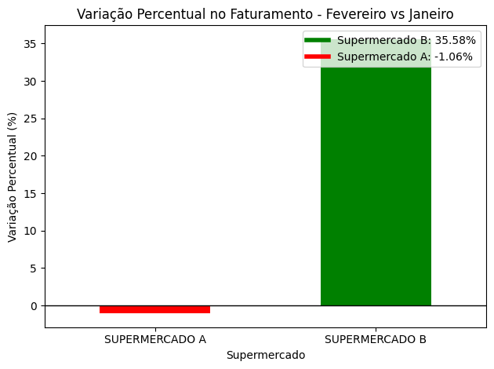
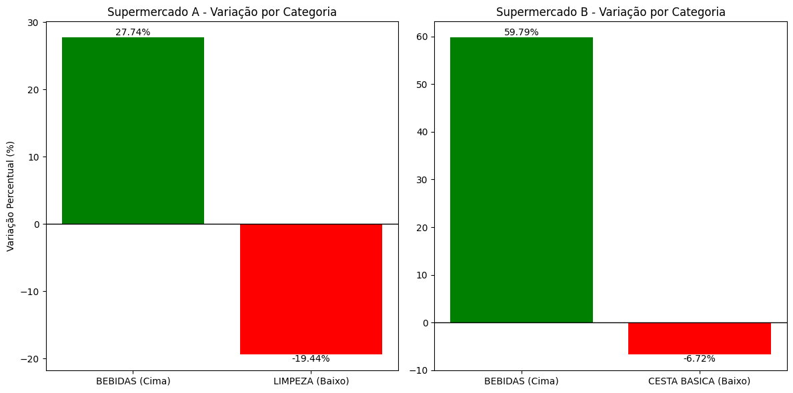
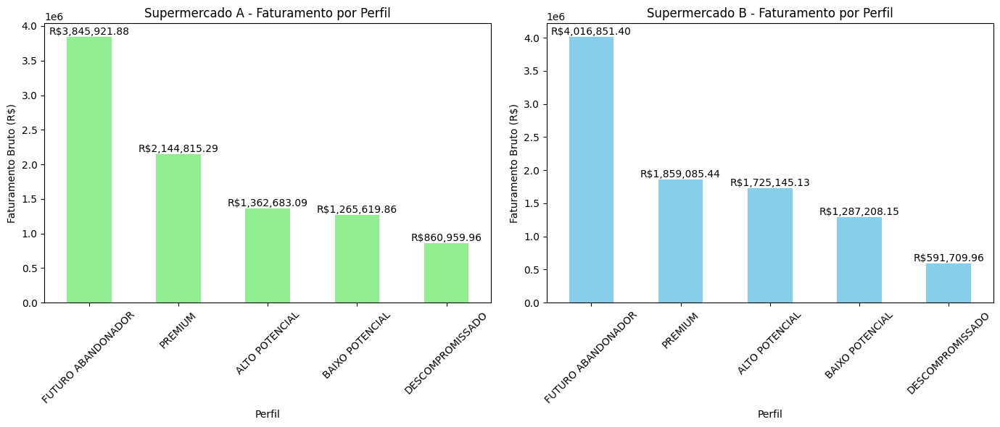
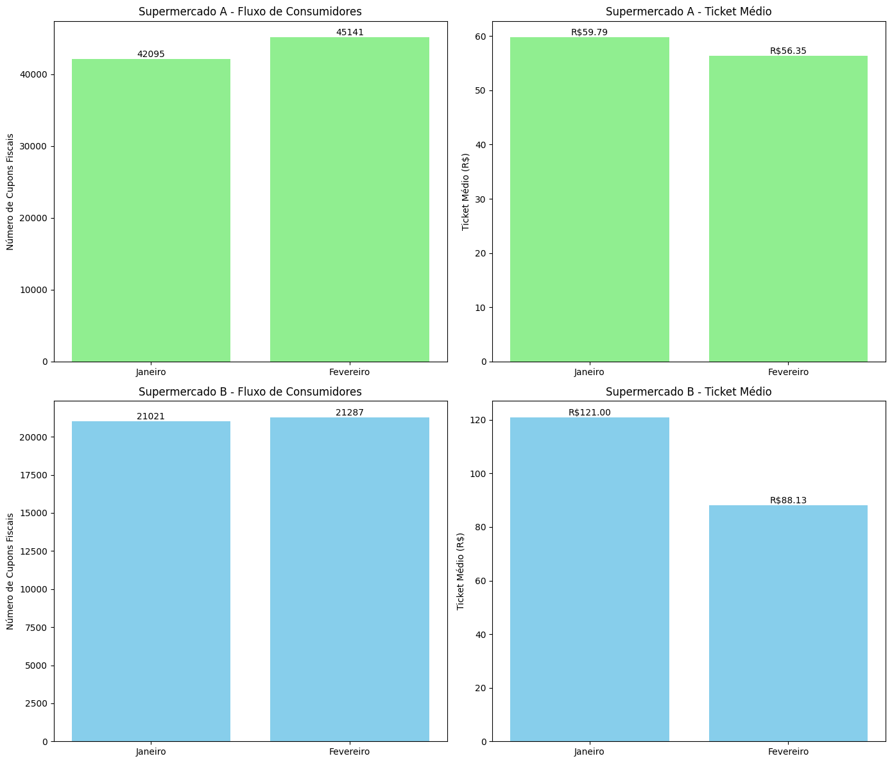

# Análise de Vendas - Supermercado A e Supermercado B

Este projeto tem como objetivo analisar os dados de vendas de dois Supermecados do Grupo, **Supermercado A** e **Supermercado B**, durante os meses de janeiro e fevereiro. 
A análise se concentra em diagnosticar o crescimento/retração das vendas, identificar as principais categorias de produtos e perfis de clientes, e fornecer recomendações práticas para os times de marketing, operações e comercial.

## Índice
1. [Diagnóstico de Crescimento/Retração de Vendas](#1-diagnóstico-de-crescimento-retração-de-vendas)
2. [Análise de Categorias de Produtos](#2-análise-de-categorias-de-produtos)
3. [Análise dos Perfis de Clientes](#3-análise-dos-perfis-de-clientes)
4. [Comportamento dos Consumidores](#4-comportamento-dos-consumidores)
5. [Recomendações](#5-recomendações)
6. [Insights para Alavancar Vendas](#6-insights-para-alavancar-vendas)

---

## 1. Diagnóstico de Crescimento/Retração de Vendas

**Objetivo**: Identificar o crescimento ou retração das vendas do grupo varejista em fevereiro em comparação com janeiro e determinar qual rede puxa o resultado.

### Resultado:
- Houve um crescimento de **14,49%** no faturamento total do grupo.
- O **Supermercado B** puxou o crescimento com um aumento de **+35,58%** no faturamento.
- O **Supermercado A** sofreu uma leve retração de **-1,06%**.
- Portanto, o **Supermercado B** foi o responsável por puxar o resultado positivo do grupo em fevereiro, compensando a leve retração do **Supermercado A**.

---

## 2. Análise de Categorias de Produtos

**Objetivo**: Verificar quais categorias de produtos impulsionaram os resultados das redes entre janeiro e fevereiro.

### Resultado:
- **Supermercado A**:
  - Categoria que puxou para cima: **Bebidas** (+27,74%)
  - Categoria que puxou para baixo: **Limpeza** (-19,44%)
- **Supermercado B**:
  - Categoria que puxou para cima: **Bebidas** (+59,79%)
  - Categoria que puxou para baixo: **Cesta Básica** (-6,72%)
    
  - Para ambos, a categoria **Bebidas** impulsionou o crescimento entre janeiro e fevereiro, enquanto **LIMPEZA** puxou para baixo no **Supermercado A** e **CESTA BASICA** no **Supermercado B**.

---

## 3.0. Análise dos Perfis de Clientes

**Objetivo**: Identificar quais perfis de clientes foram mais determinantes para os resultados em cada rede.

### Resultado:
- **Supermercado A**:
  -  **Futuro Abandonador**: R$ 3.845.921,88
  -  **Premium**: R$ 2.144.815,29
  -  **ALTO POTENCIAL**: R$ 1.362.683,09
  -  **BAIXO POTENCIAL**: R$ 1.265.619,86
  -  **DESCOMPROMISSADO**: R$ 860.959,96
- **Supermercado B**:
  - **Futuro Abandonador**: R$ 4.016.851,40
  - **Premium**: R$ 1.859.085,44
  - **ALTO POTENCIAL**: R$ 1.725.145,13
  - **BAIXO POTENCIAL**: R$ 1.287.208,15
  - **DESCOMPROMISSADO**: R$ 591.709,96
 
  - O perfil **FUTURO ABANDONADOR** foi o mais determinante em termos de faturamento para ambos os supermercados.
Outros perfis, como **PREMIUM** e **ALTO POTENCIAL**, também tiveram contribuições significativas, mas em menor escala.

## 3.1 Estratégias entre Categorias e Clientes

**Objetivo**: Identificar se existem estratégias diferentes entre os Supermecados.

### Resultado:
- **Supermercado A**:
 - A categoria **BEBIDAS** teve um crescimento de +27,74%
 - **LIMPEZA** apresentou uma retração de -19,44%
 - O **Supermercado A** tem grande dependência de clientes que estão classificados como **FUTURO ABANDONADOR**. Oque indica uma falta de fidelização ou perda iminente de clientes.

- **Supermercado B**:
  - **BEBIDAS** cresceu ainda mais, com um aumento de +59,79%
  - **CESTA BASICA** apresentou uma leve queda de -6,72%
  - **FUTURO ABANDONADOR** também lidera (R$ 4.016.851,40)
  - Os perfis **PREMIUM** e **ALTO POTENCIAL** tem contribuições mais significativas doque no **Supermercado A**, oque aponta também para dificuldades na fidelização mas um equilíbrio melhor entre os perfis.
 
  - Ambos têm BEBIDAS como principal motor de crescimento, sugerindo uma estratégia comum. No entanto, o **Supermercado A** tem problemas mais evidentes com a categoria **LIMPEZA**, enquanto o **Supermercado B** apresenta uma leve queda em **CESTA BASICA**.
A dependência de clientes classificados como **FUTURO ABANDONADOR** é notável em ambas as redes, mas o **Supermercado A** parece ser mais vulnerável. O **Supermercado B** tem um mix mais distribuido de clientes com **PREMIUM** e **ALTO POTENCIAL**, ainda sim está claro que ambos tem dificuldades em atrair e reter clientes.
---

## 4. Comportamento dos Consumidores

**Objetivo**: Verificar se o movimento foi impulsionado por fluxo de consumidores ou por alteração no ticket médio.

### Resultado:
- **Supermercado A**:
  - Fluxo de consumidores: **Diminuiu** (45.141 em janeiro para 42.095 em fevereiro)
  - Ticket médio: **Aumentou** (R$ 56,35 para R$ 59,79)
  - O movimento em fevereiro foi puxado mais por um aumento no ticket médio, apesar de uma leve queda no fluxo de consumidores.
- **Supermercado B**:
  - Fluxo de consumidores: **Estável**
  - Ticket médio: **Aumentou** (R$ 88,13 para R$ 121,00)
  - O crescimento em fevereiro foi fortemente puxado por um aumento no ticket médio, enquanto o fluxo de consumidores praticamente ficou estável.

---

## 5. Recomendações

### **Marketing**
- **Supermercado A**:
  - Focar na Fidelização: O perfil FUTURO ABANDONADOR representa uma grande parte das receitas, o que indica um risco de perda de clientes importantes. O time de marketing deve implementar campanhas de fidelização para reter esses clientes, como programas de recompensas, descontos personalizados e comunicação direcionada
especialmente para categoria LIMPEZA que apresentou uma retração significativa. Ainda é possivel fortalecer o setor com analises que considerem periodos dentro do mês, produtos do setor mais vendidos e dados geograficos para fortalecer as vendas com promoções direcionadas.
- **Supermercado B**:
  - Aproveitar o Crescimento no Ticket Médio: O ticket médio aumentou significativamente, sugerindo que os clientes estão dispostos a gastar mais por compra. O marketing deve capitalizar isso promovendo produtos de ticket mais alto, principalmente no setor de BEBIDAS. Também cabe atenção a dados temporais e geograficos, para focar campanhas em festividades regionais e nacionais para promover as vendas.

### **Operações**
- **Supermercado A**:
  - Otimização do Estoque de Limpeza: Dado o declínio nas vendas de produtos de limpeza, pode ser necessário rever a alocação de espaço no estoque e no piso de vendas. É possível que esses produtos estejam sendo mal posicionados ou não estejam disponíveis em quantidades adequadas.
Focar na Experiência do Cliente: Como o fluxo de clientes caiu podemos tentar melhorar a experiencia investindo em treinamentos da equipe, manutenção e limpeza do estabelecimento, mas caso seja dificil identificar ou tenhamos um caixa limitado para esse investimento o melhor seria aplicar pesquisas no caixa, corredores ou no pós compra afim de obter o primeiro direcionamento. 
- **Supermercado B**:
  - Gerenciamento de Estoque para Bebidas: Com a categoria sendo tão forte, o time de operações precisa garantir que não haja rupturas de estoque e que os produtos estejam sempre bem abastecidos.
Aprimoramento da Experiência em Loja: Com o crescimento no ticket médio, o foco está em melhorar a organização da loja, criando uma experiencia mais fluida como um roteiro que beneficie principalmente os produtos com ticket maior.

### **Comercial**
- **Supermercado A**:
  - Contratos do setor Limpeza: É importante rever acordos comerciais com fornecedores da categoria. Podem ser necessários novos contratos que ofereçam melhores condições, margens mais competitivas ou promoções mais atraentes para reverter a retração nessa categoria. Uma analise mais especifica por produto pode ajudar na argumentação.
- **Supermercado B**:
  - Rever Ofertas da Cesta Básica: A retração nessa categoria sugere que os preços podem estar desalinhados com a expectativa do consumidor. Negociações com fornecedores para ajustar os preços ou desenvolver promoções mais atraentes são essenciais.

---

## 6. Insights para Alavancar Vendas

1. **Fidelização de Clientes**
Insight: O perfil Futuro Abandonador está gerando uma grande parte do faturamento em ambas as redes, mas é um grupo de clientes em risco de abandono.
O marketing deve lançar campanhas de fidelização personalizadas/cumulativas para esses clientes e inseri-los em uma régua de comunicação especial sobre promoções basedas no histórico de compras.

2. **Promoções Sazonais**
Insight: A categoria de Bebidas está claramente puxando o crescimento em ambas as redes. Há uma oportunidade de continuar explorando essa tendência.
Ação de Marketing: Criar promoções sazonais focadas em feriados, eventos esportivos, festas de fim de ano, ou momentos onde o consumo de bebidas aumenta.

3. **Upselling e Cross-Selling**
Insight: O ticket médio aumentou, indicando que os clientes estão dispostos a gastar mais por compra. Isso sugere que há espaço para upselling (vender produtos de maior valor) e cross-selling (venda de produtos complementares).
Ação de Marketing: Implementar campanhas que sugiram produtos complementares ou de maior valor no ponto de venda e nas plataformas digitais. Oferecer pacotes que combinem diferentes categorias de produtos.

4. **Recuperação de Categorias em Declínio**
Insight: Algumas categorias, como Limpeza no Supermercado A e Cesta Básica no Supermercado B, estão em declínio. Esses produtos são essenciais e, se recuperados, podem estabilizar o desempenho.
Ação de Marketing: Promover campanhas de preços competitivos e ofertas especiais nessas categorias. Implementar campanhas promocionais que destaquem os benefícios e a qualidade dos produtos dessas categorias.

5. **Campanhas Geolocalizadas para Diferentes Lojas**
Insight: Se houver dados geográficos disponíveis, o marketing pode explorar o desempenho por região.
Ação de Marketing: Realizar campanhas geolocalizadas focadas em lojas que tiveram baixo desempenho, incentivando os consumidores dessas regiões a visitarem a loja com promoções regionais.

---
